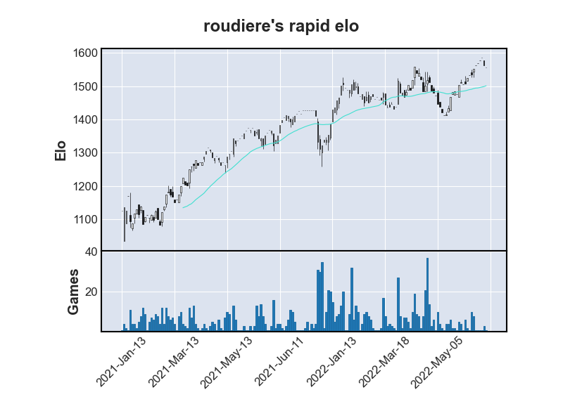
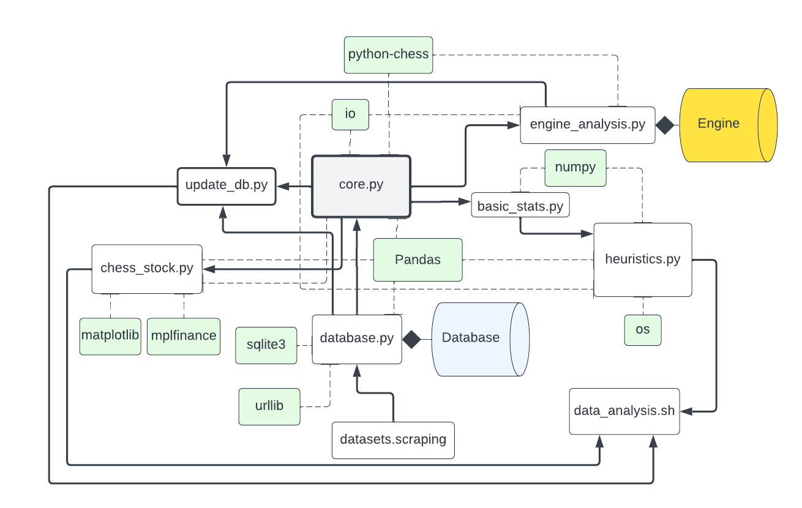

# chess-analysis

This is an ongoing project, inspired from Lichess' analysis tools.

At the time of creation, Chess.com did not have an analysis feature, so I decided to implement some of the functions.

# features

## database 
Save all games in a database for later retrieval.
## engine analysis
All games are analyzed using Stockfish 14.
## heuristics
Custom heuristics, such as average centipawn loss, opportunistic/luckiness, and more are available for use.

# usage stuff
## database
### updating
- ```update_db.py``` gets games from the current month.
- To get from games further back in time, use ```get_games()``` in ```core.py``` manually.

## engine
### installation
- run `brew install stockfish`
### finding after installation
- make sure you are in CHESS_ANALYSIS, and run:
`cd /usr/local/opt/`

# structure


## core.py
The fundamental building block of the program.
- ```global``` ```string``` ```user```: username in PGNs
- ```global``` ```games_list```: an array containing all games (see ```python-chess```)

### DatabaseTool()
#### attributes
- conn: ```Connection``` a connection to the database
- cur: ```Cursor``` a cursor on the database
- full_collection: ```DataFrame``` all of the games
#### functions

```get()```: gets games from database
- ```filters```: ```dict``` all filters to apply
  - default ```None```
- ```db```: ```string``` table name to search
  - default ```"games"```

```get_by_column_name()```: gets games by column name
  - ```col_name```: ```string``` field name
  - ```table```: ```string``` table name